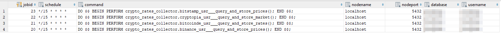
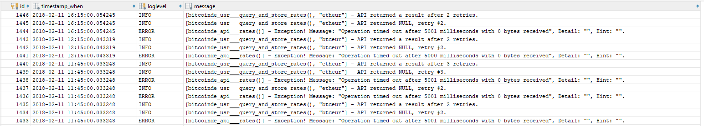
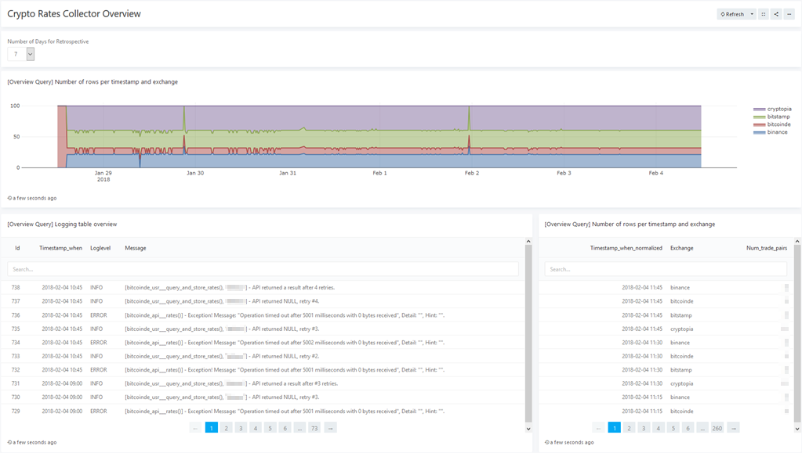

# Postgresql-based cryptocurrency rate collector
This Postgresql schema and stored functionalities currently **exclusively** collect cryptocurrency rates from (currently) four exchanges:
* bitcoin.de (https://bitcoin.de/) => this API is *not* public, you need a personal API key and a corresponding API secret, see below for further information.
* Binance (https://www.binance.com/).
* Bitstamp (https://www.bitstamp.net/).
* Cryptopia (https://www.cryptopia.co.nz/).

Maybe someone finds this useful and/or interesting.

# Why would you do this...the horror...?
Because I know Postgresql best and I wanted to extend my knowledge on some specific extensions while diving deeper into the topic of cryptocurrencies and exchange APIs. Simple as that. Also, why not? Please also keep in mind, that I am not a professional software developer or DB architect, but merely a "technical project lead" guy leading R&D software projects in the domain of "life science industry". I do such things for fun on my own time, not for achieving software quality standards suitable for Enterprise-grade deployment.

If you want to use this yourself or not, you have to judge by yourself. Querying HTTP endpoints and parsing the (JSON) response directly in Postgresql may not be the brightest idea of the century, but it sure is convenient (for me). Since in the end this is one of my fun projects, it perfectly fits my own requirements - it may not fit yours, though.

# Hardware and software requirements
* Postgresql 9.6+, Postgresql 10+ is preferred (I developed on Postgresql 10, but it *should* work on older versions, too - it's untested, though).
* Linux or Docker on a suitable host (developed in Docker under Linux, not tested on Windows at all, and I don't intend to).
* A small box is sufficient at the moment. My development and productive hardware is a quite weak dual-core, dual-thread, passively cooled Atom N3000 with 8GB RAM. Here, Postgresql runs in a Docker container next to a Gitlab instance in Docker, Portainer and some more small stuff (all in Docker). RAM is quite full now, but performance for this code here is still completely fine.

In general, the (stored) functionality in the schema needs the following Postgresql extensions installed and available (`CREATE EXTENSION ...`):
* pg_cron (https://github.com/citusdata/pg_cron).
* pgsql_http (https://github.com/pramsey/pgsql-http).

# How to deploy
The deployment options, possibly based on a Docker container, are described in more detail here:

[deployment.md](/docs/deployment.md)

# Configuration
How to configure API access, delays etc. (especially for the non-public Bitcoin.de API) is described in more detail here:

[configuration.md](/docs/configuration.md)

# How data is collected regularly
Altogether there are four pg_cron jobs, one for each exchange:

Each job is started at exactly 00, 15, 30 and 45 minutes of an hour, so the four exchanges are always queried in parallel.

Trade pairs of an exchange are queried sequentially, with a configurable delay between each trade pair (3s by default). If an attempt to get data for a trade pair was not successful, a configurable number of retries is made (6 by default), with an increasing delay in between (`delay * retry_number`). If after the last retry the API's HTTP response is still NULL, then the query job gives up on the trade pair and will try again at the next 15-minute-mark only.

# Logging
Logging messages and caught exceptions are recorded in the table T_LOG and consist of an auto-incrementing ID, timestamp, loglevel and the message itself:

Allowed (and used) log levels are: DEBUG, INFO, WARN, ERROR.

# Querying data / data views
Sample queries, and the sources (tables, views) they are based on, are described in more detail here:

[tables_views_example_queries.md](/docs/tables_views_example_queries.md)

# Visualizing data
* Redash (https://github.com/getredash/redash), which I use myself.
  * 
* Apache Superset (formerly AirBnB Superset, formerly AirBnB Caravel: https://github.com/apache/incubator-superset).
* R Shiny (https://shiny.rstudio.com/).
* Whatever you know and deem fitting.

# Future plans
* Integrate more exchanges...? I currently have no personal need for this, though.
* A strategy to handle missing values (single and multiple, e.g. BTCEUR is missing from Bitstamp three times in a row).
* Integrate the schema deployment into a Docker container (Docker entrypoint and the likes) in order to automate the (still destructive, as I may notice) deployment.
* Play around with TimescaleDB (https://github.com/timescale/timescaledb) and possibly create an additional "analysis schema".
* Play around with Apache MADlib (https://github.com/apache/madlib).